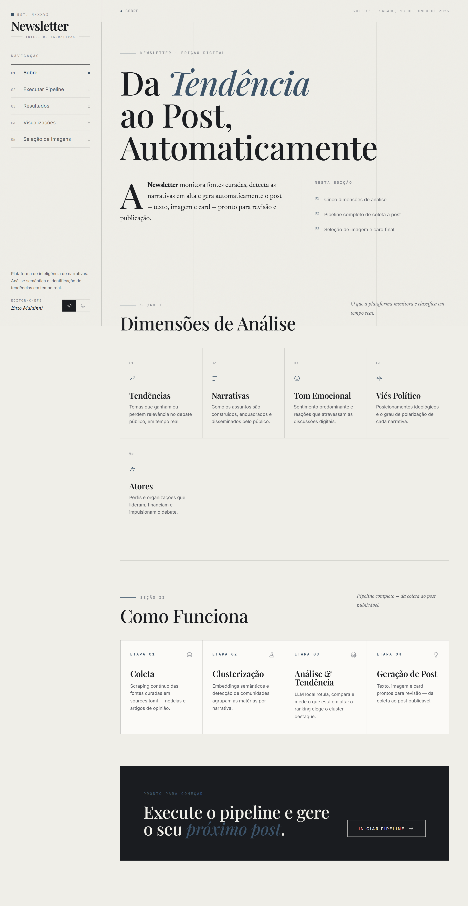
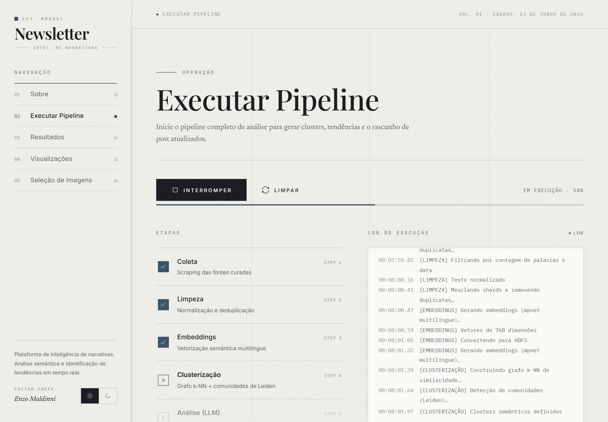
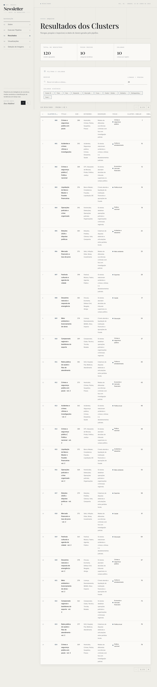
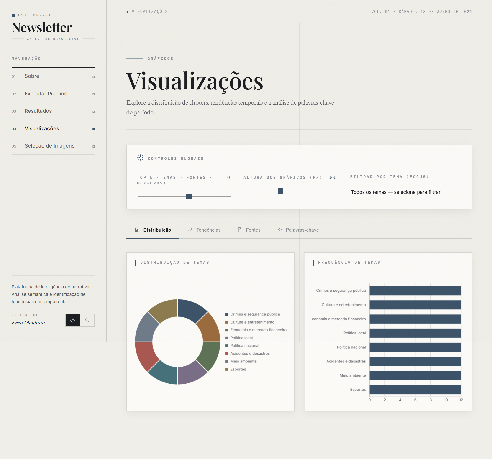

# Newsletter — Inteligência de Narrativas

Ferramenta que **detecta tendências** em fontes de notícia curadas e **gera automaticamente posts nichados** para redes sociais — do scraping à arte final do card, com um humano no loop antes de publicar.

O pipeline coleta artigos das fontes em `config/ingestion/sources.toml`, agrupa as matérias por narrativa (embeddings + clusterização semântica), analisa cada grupo com um LLM local, ranqueia o que está **em alta** e produz um rascunho de post (texto + imagem + card) numa **fila de aprovação**.



---

## Como funciona

Pipeline completo em 15 etapas (`src/utils/pipeline_runner.py`), agrupadas em 4 estágios:

| Estágio | Etapas | O que faz |
|---------|--------|-----------|
| **Coleta** | Scraping → Limpeza | Descobre e extrai artigos das fontes curadas; normaliza, deduplica e filtra. |
| **Clusterização** | Embeddings → HDF5 → Grafo k-NN → Leiden → Organização | Vetoriza os textos (`paraphrase-multilingual-mpnet-base-v2`), monta um grafo de similaridade e detecta comunidades semânticas com o algoritmo de **Leiden**. |
| **Análise (LLM)** | Definição → Distinção → Tendências → Dimensões | Um LLM local (Ollama · `qwen2.5:7b`) rotula cada cluster, compara clusters vizinhos, mede o que mudou entre textos antigos e recentes e descreve 9 dimensões discursivas. |
| **Geração** | Ranking de tendência → Post → Busca de imagens → Card | Pontua os clusters por **aceleração + recência**, gera o texto do post do cluster destaque, busca imagens licenciadas e compõe o card final. |

A saída vai para `data/output/posts_queue/` como rascunho `pending_review` — **nada é publicado automaticamente**.

---

## A aplicação

Front-end editorial (React) servido por um backend FastAPI, ligado aos dados reais do pipeline.

### Executar Pipeline — log ao vivo



### Resultados dos Clusters



### Visualizações



### Seleção de Imagens

Imagens candidatas extraídas de fontes **licenciadas** (Wikimedia Commons, Pexels), cada uma com licença e crédito. Você escolhe a capa e o carrossel; a seleção alimenta a composição do card.


---

## Arquitetura

```
.
├── server.py                 # backend FastAPI (serve o front + /api/*)
├── app.py                    # UI legada em Streamlit (também funcional)
│
├── scraper.py · cleaner.py · embedder.py · h5_converter.py
├── graph_construction.py · community_detection.py · organizer.py
├── cluster_definition.py · cluster_distinction.py
├── extract_trends.py · assess_dimensions.py
├── rank_trends.py            # Etapa 12 — ranking de tendência
├── generate_posts.py         # Etapa 13 — geração do post
├── fetch_images.py           # Etapa 14 — busca de imagens
├── compose_cards.py          # Etapa 15 — composição do card
│
├── config/
│   ├── directories.toml
│   ├── clustering.toml
│   ├── ingestion/            # sources.toml, scraping, cleaning, embedding
│   └── analysis/semantic.toml  # LLM, trends, ranking, post, imagens, card
│
├── src/
│   ├── classes/data_types.py
│   ├── utils/                # scraping, embedding, clustering, ranking, posts, images, cards…
│   └── visualizations/matplotlib_charts.py
│
├── frontend/                 # SPA React (Babel no navegador)
│   ├── index.html
│   ├── app.jsx · shared.jsx
│   └── pages/                # about · pipeline · results · viz · images
│
└── data/                     # raw / processed / checkpoints / output (output/ é gitignored)
```

---

## Pré-requisitos

- **Python 3.11+**
- **[Ollama](https://ollama.com/)** rodando localmente com o modelo de análise:
  ```bash
  ollama pull qwen2.5:7b
  ```
- Dependências Python:
  ```bash
  pip install fastapi "uvicorn[standard]" streamlit pandas requests beautifulsoup4 \
              newspaper3k python-dateutil sentence-transformers python-igraph leidenalg \
              psutil h5py tqdm langchain-ollama langchain-core matplotlib wordcloud \
              pillow python-dotenv
  ```

---

## Configuração

- **Fontes** — `config/ingestion/sources.toml`: cada fonte tem `url`, domínios permitidos e regex de allow/deny de URLs.
- **Análise / geração** — `config/analysis/semantic.toml`: modelo do LLM, janelas e pesos do ranking de tendência (`[trend_ranking]`), tom e audiência do post (`[post_generation]`), busca de imagens (`[image_search]`) e layout do card (`[card]`).
- **Embeddings** — `config/ingestion/initial_embedding.toml`: modelo e tamanho de lote.
- **Chaves (opcional)** — crie `keys.env` (gitignored) com `PEXELS_API_KEY=...` para incluir o Pexels na busca de imagens. Sem a chave, a busca usa só a Wikimedia Commons.

---

## Como rodar

### Aplicação web (recomendado)

```bash
py -m uvicorn server:app --reload
# abrir http://127.0.0.1:8000
```

### UI legada (Streamlit)

```bash
streamlit run app.py
```

### Pipeline pela linha de comando

Rodar etapa a etapa (mesma ordem do `pipeline_runner`):

```bash
py scraper.py
py cleaner.py
py embedder.py
py h5_converter.py
py graph_construction.py
py community_detection.py
py organizer.py
py cluster_definition.py      # requer Ollama
py cluster_distinction.py     # requer Ollama
py extract_trends.py          # requer Ollama
py assess_dimensions.py       # requer Ollama
py rank_trends.py
py generate_posts.py          # requer Ollama
py fetch_images.py
py compose_cards.py
```

O resultado final fica em `data/output/posts_queue/` (rascunho do post + `candidates.json` de imagens + `card.jpg`).

---

## Fluxo de aprovação

1. O pipeline gera o post com status `pending_review` e baixa imagens candidatas.
2. Na página **Seleção de Imagens**, você marca a capa (★) e as imagens do carrossel — a escolha é gravada no `candidates.json`.
3. `compose_cards.py` monta o card final usando a capa escolhida.
4. Revise o rascunho e publique manualmente.

**Transparência e segurança:** todo post leva, por padrão, a **fonte citada** e um **rótulo de conteúdo assistido por IA** — gravados também na própria imagem do card. Em período eleitoral valem as regras de rotulagem de conteúdo sintético (TSE).

---

## Status

- ✅ Pipeline completo (coleta → tendência → post → imagem → card)
- ✅ Backend FastAPI + front React, com **Resultados** e **Seleção de Imagens** ligados aos dados reais
- 🚧 **Em andamento:** ligar **Executar Pipeline** (execução real com log) e **Visualizações** aos dados reais; build de produção do front (Vite)
